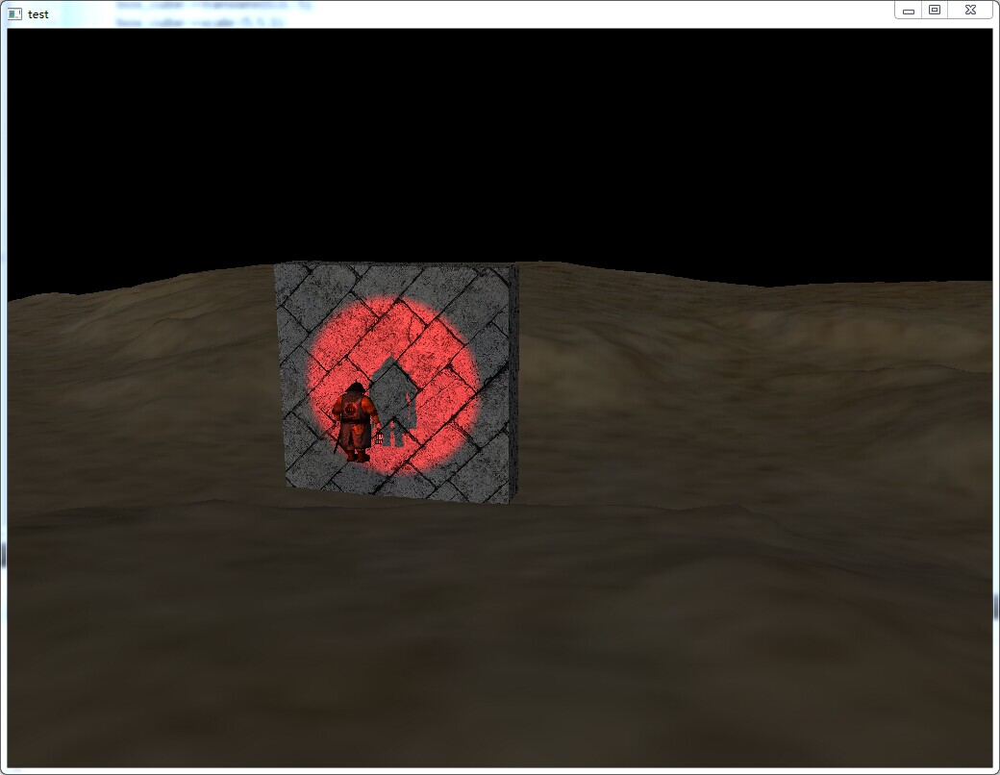

===================
###what's this?###

<b>Cube Engine</b> is my own hobby porject, It's a small Graphic Engine written in c++ and powered by OpenGL (ES 2.0 or higher), I develop it so that I can improve my knowledges of CG and common programming Skills(generic algorithm ,code style ,design patterns).

Any questions or ideas please contact me:   tzwtangziwen@163.com <b>or</b> ziwen.tang@chukong-inc.com

###Features:###
1. Camera Control
2. Commons Model Format loading with Skeleton Animation
3. SkyBox
4. Terrain generate and render from HeightMap
5. Lighting (ambient ,diffuse ,specular)
6. NormalMapping
7. ShadowMapping with soft edges
8. deferred shading

###requirement###
* <b>libassimp:</b> If you use Windows, the project have a modified copy under the  <b>"cube/external"</b> folder
* <b>Qt framework and qt-creator:</b> only use if you compile with Qt
* Opengl ES 2.0 (forward shading) or 3.0(deffered shading)

###How to Build?###
* <b>Use Qt:</b> currently, I use Qt framework As a backend,so you need qt-creator.just use qt-creator open the file <b>cube.pro</b> in the <b>"cube"</b> folder and bulid it,when you finish ,drag the <b>"res"</b> folder to your build directory like <b>"build-cube-Desktop_Qt_XXXXX-Debug"</b>
* <b>without Qt:</b> you also can compile the cube engine without Qt, but you need modify the <b>backend.cpp</b>,and handle the delegate's by yourself,it's not too hard to switching the Qt backend to such like <b>GLFW</b> or <b>SDL</b>

###screenshot###

###简介###

<b>Cube Engine</b>是我的一个业余项目——一个使用C++ 以及 OpenglEs 编写的轻量级的图形引擎。 开发这个项目旨在提高个人对图形学的认识，通用编程技巧，以及对代码的组织能力

对CubeEngine有任何的疑问或好的建议请使用以下邮件地址方式联系我:   tzwtangziwen@163.com <b>or</b> ziwen.tang@chukong-inc.com

###引擎特性:###
1. 相机控制
2. 模型载入以及骨骼动画
3. 天空盒
4. 地形渲染
5. 光照
6. 法线贴图
7. 阴影(ShadowMapping)
8. 延迟渲染

###依赖包###
* <b>libassimp库:</b> 如果你使用的是Windows平台,可以不需要额外的assimp库支持，在项目文件夹下的 <b>"cube/external"</b> 目录里，包含一个修改版本的assimp库
* <b>Qt framework 以及 qt-creator:</b> 只在您使用Qt来编译时才是必须的（默认使用qt编译）
* Opengl ES 2.0 (前向渲染必需) or 3.0(延迟渲染必需) 或等价的桌面版本OpenGL.

###如何编译?###
* <b>使用 Qt的情形下:</b> 目前, 默认使用 Qt framework作为引擎的后端,所以你需要安装一个 qt-creator.只需要使用 qt-creator 打开在<b>"cube"</b>目录下名为<b>cube.pro</b>的工程文件就可以编译了,编译完成后,将工程目录下的<b>"res"</b>文件夹拖拽至你编译文件的文件下即可，编译的文件夹的名称类似于<b>"build-cube-Desktop_Qt_XXXXX-Debug"</b>
* <b>不使用Qt的情形下:</b> 你当然可以在不使用QT的情况下编译, 但是你需要对<b>backend.cpp</b>文件进行少许的修改,并需要自定义 delegate的回调,这样你就可以轻松地将QT的后端改为使用诸如<b>GLFW</b>或<b>SDL</b>来管理

###説明###

<b>Cube Engine</b>は私の仕事の暇のプロジェクト——C++及び OpenglEs で編んだライト級グラフィックエンジンであります。個人がコンピューターグラフィックスに対する認識、一般プログラミング技術及びコードの組織能力を高めるために該プロジェクトを開発した。

CubeEngineに対しいかなる疑問あるいはよい意見があれば以下の電子メールアドレスで私と連絡してほしい：  tzwtangziwen@163.com <b>or</b> ziwen.tang@chukong-inc.com

###エンジン特性###
1.カメラ制御
2.モデルロード及び骨格アニメーション
3.スカイボックス
4.地形レンダリング
5.イルミネーション
6.ノーマルコラージュ
7.シャドーマッピング
8.遅延レンダリング

　

###依存パッケージ###
* <b>libassimpライブラリ：</b>Windowsプラットフォームとすると、余計なassimpライブラリ支持が必要せず、プロジェクトフォルダの<b>"cube/external"</b>カタログに、改訂したバージョンのassimpライブラリを含む
* <b>Qt framework 及びqt-creator:</b> はあなたがQtで編集と翻訳するときだけに必要とする（qtで編集と翻訳のは黙認だ）
* Opengl ES 2.0 （フォワードレンダリング必要）or 3.0（遅延レンダリング必要）あるいは同等のデスクトップ版OpenGL.

###編集と翻訳について###
* <b>Qtの場合：</b> いまのところ、I は Qt framework As を黙認しエンジンのバックエンドにし、 それでqt-creatorをインストール必要があり、 qt-creator で<b>"cube"</b>カタログにある<b>cube.pro</b>というプロジェクトファイルをオープンだけで編集と翻訳でき、終わったら、プロジェクトカタログの<b>"res"</b>フォルダをあなたがファイルを編集と翻訳するファイルにドラッグ·アンド·ドロップだけでよい、そのフォルダの名は<b>"build-cube-Desktop_Qt_XXXXX-Debug"</b>のように
* <b>Qtではない場合：もちろんQTを使わなくても編集と翻訳できるが、b>backend.cpp</b>ファイルに対し少しの改訂が必要とし、delegateのコールバックをカスタム必要があり、そうするとQTのバックエンドを<b>GLFW</b>や<b>SDL</b>で管理することにする。
##ChangeLog##

###alpha v0.08b 2.2.2015###
* support multiple shadowMap(finally support directional light)
* code refactor
* add a brief chinese doc
* 
###alpha v0.08 1.27.2015###
* Add AABB
* Add Ray
* Fix material BUG
* SkyBox finnaly support in deferred-rendering mode
* Add Bloom Effect
* Add simple 2D element
* Add Node Groupping 
###alpha v0.07 12.18.2014###
* add basic deferred-shading support, the deferred shading system can allow you create lots of Lights.
* lot's of bug fixed

###alpha v0.06 12.2.2014###
* Refactor lot's of code
* Fix the Terrain's default position

###alpha v0.05 11.24.2014###
* Now lots's of Classes are inherited from the 'Node' class, you can easy handle them(Entity,Camera ,etc) hierarchically via unified interface  
engine now can render terrian from a height map , see demo

###alpha v0.04 11.19.2014#
* Add normal mapping

###alpha v0.03-1 11.17.2014#
* Refactor code

###alpha v0.03 11.13.2014#
* Add skybox
* Fix texture's path 
* Refactor code

###alpha v0.02 11.10.2014#
* Add skeleton animation
* Add shadow map

###alpha v0.01 10.30.2014#
* Basic camera
* Support for model loading.
* Material system
* Basic Lighting : directionalLight , spotLight , pointLight
