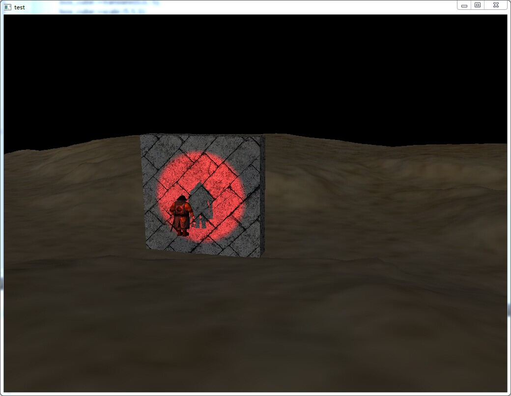
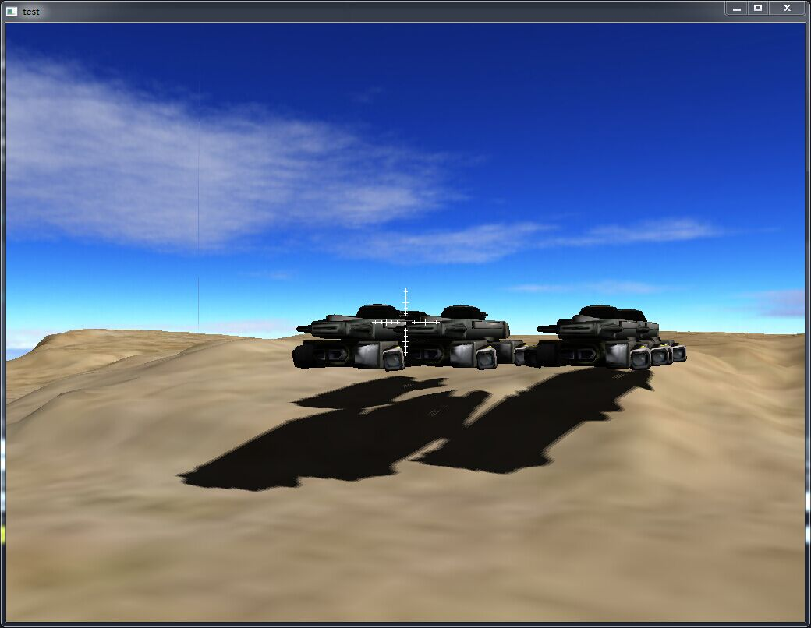

===================
###what's this?###

<b>Cube Engine</b> is my own hobby porject, It's a small Graphic Engine written in c++ and powered by OpenGL (ES 2.0 or higher), I develop it so that I can improve my knowledges of CG and common programming Skills(generic algorithm ,code style ,design patterns).

Any questions or ideas please contact me:   tzwtangziwen@163.com <b>or</b> ziwen.tang@chukong-inc.com

###Features:###
1. Camera Control
2. Commons Model Format loading with Skeleton Animation
3. SkyBox
4. Terrain generate and render from HeightMap
5. Lighting (ambient ,diffuse ,specular)
6. NormalMapping
7. ShadowMapping (CSM PCF)
8. deferred shading

###requirement###
* <b>libassimp:</b> If you use Windows, the project have a modified copy under the  <b>"cube/external"</b> folder
* <b>Qt framework and qt-creator:</b> only use if you compile with Qt
* Opengl ES 2.0 (forward shading) or 3.0(deffered shading)

###How to Build?###
* <b>Use Qt:</b> currently, I use Qt framework As a backend,so you need qt-creator.just use qt-creator open the file <b>cube.pro</b> in the <b>"cube"</b> folder and bulid it,when you finish ,drag the <b>"res"</b> folder to your build directory like <b>"build-cube-Desktop_Qt_XXXXX-Debug"</b>
* <b>without Qt:</b> you also can compile the cube engine without Qt, but you need modify the <b>backend.cpp</b>,and handle the delegate's by yourself,it's not too hard to switching the Qt backend to such like <b>GLFW</b> or <b>SDL</b>

###screenshot###
* an actor play animation under the spotLight

* Cascaded Shadow Maps for huge scene

##ChangeLog##

###alpha v0.09 3.9.2015###
* support for cascaded shadow maps(CSM) for directional light,you can use it for huge scene shadow generation.

###alpha v0.08b 2.2.2015###
* support multiple shadowMap(finally support directional light)
* code refactor
* add a brief chinese doc
* 
###alpha v0.08 1.27.2015###
* Add AABB
* Add Ray
* Fix material BUG
* SkyBox finnaly support in deferred-rendering mode
* Add Bloom Effect
* Add simple 2D element
* Add Node Groupping 
###alpha v0.07 12.18.2014###
* add basic deferred-shading support, the deferred shading system can allow you create lots of Lights.
* lot's of bug fixed

###alpha v0.06 12.2.2014###
* Refactor lot's of code
* Fix the Terrain's default position

###alpha v0.05 11.24.2014###
* Now lots's of Classes are inherited from the 'Node' class, you can easy handle them(Entity,Camera ,etc) hierarchically via unified interface  
engine now can render terrian from a height map , see demo

###alpha v0.04 11.19.2014#
* Add normal mapping

###alpha v0.03-1 11.17.2014#
* Refactor code

###alpha v0.03 11.13.2014#
* Add skybox
* Fix texture's path 
* Refactor code

###alpha v0.02 11.10.2014#
* Add skeleton animation
* Add shadow map

###alpha v0.01 10.30.2014#
* Basic camera
* Support for model loading.
* Material system
* Basic Lighting : directionalLight , spotLight , pointLight
