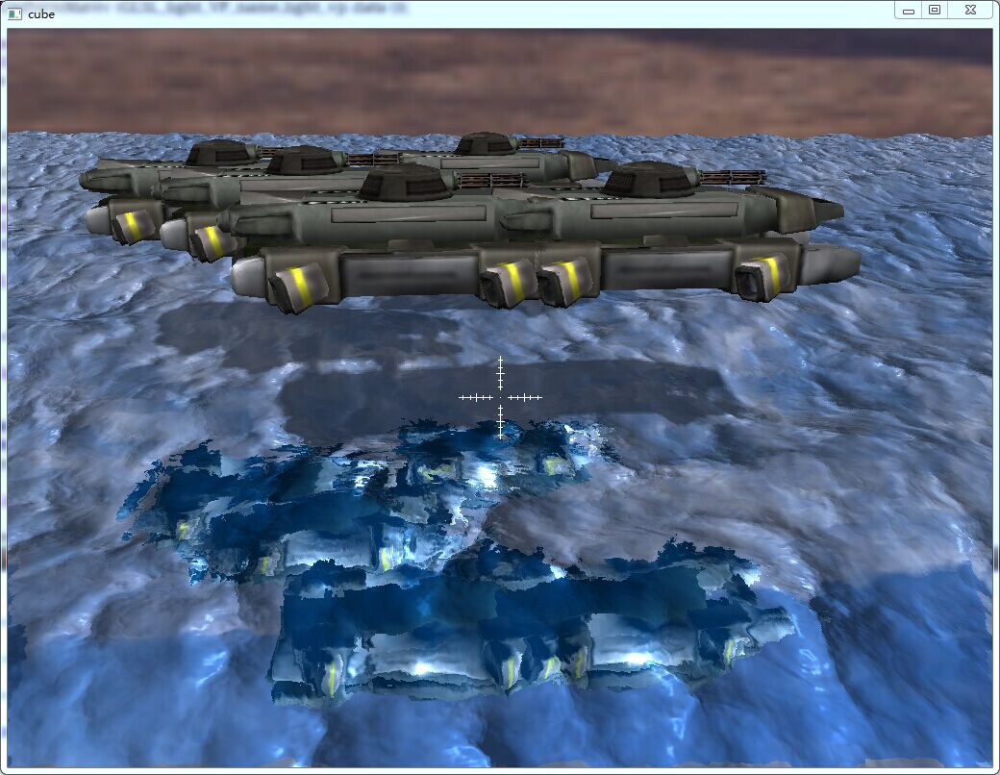

===================
###What's This?###

<b>Cube Engine</b> is my own hobby porject, It's a small Graphic Engine written in c++ and powered by OpenGL (ES 2.0 or higher), I develop it so that I can improve my knowledges of CG and common programming Skills(generic algorithm ,code style ,design patterns).

Any questions or ideas please contact me:   tzwtangziwen@163.com <b>or</b> ziwen.tang@chukong-inc.com

###Features:###
1. Camera Control
2. Commons Model Format loading with Skeleton Animation
3. SkyBox
4. Terrain generate and render from HeightMap
5. Lighting (ambient ,diffuse ,specular)
6. NormalMapping
7. ShadowMapping (CSM PCF)
8. deferred shading
9. unlimited water surface
10. basic GUI and text rendering.

###Current Version###
* the current version is alpha v0.13 7.9.2015

###Requirement###
* <b>libassimp:</b> If you use Windows, the project have a modified copy under the  <b>"cube/external"</b> folder
* <b>Qt framework and qt-creator:</b> only use if you compile with Qt
* Opengl ES 2.0 (forward shading) or 3.0(deffered shading)

###How To Build?###
* <b>Use Qt:</b> currently, I use Qt framework As a backend,so you need qt-creator.just use qt-creator open the file <b>cube.pro</b> in the <b>"cube"</b> folder and bulid it,when you finish ,drag the <b>"res"</b> folder to your build directory like <b>"build-cube-Desktop_Qt_XXXXX-Debug"</b>
* <b>without Qt:</b> you also can compile the cube engine without Qt, but you need modify the <b>backend.cpp</b>,and handle the delegate's by yourself,it's not too hard to switching the Qt backend to such like <b>GLFW</b> or <b>SDL</b>

###Screenshot###
* an actor play animation under the spotLight

* Cascaded Shadow Maps for huge scene

* Unlimited water surface use projected-grid

###Future Plans###
* Octree scene manager intergrated.(not focus it yet)
* Basic UI support.(currently support some basic button and label, orz. need hustle in it)
* Imrpove Lighting system.(use some advance lighting models to rendering secene.)
* Strip down the assimp code, use our own file format "*.tzw"(.tzw file currently only support static model,the models which have skin animation still need Assimp (via "external/converter", not directly)).