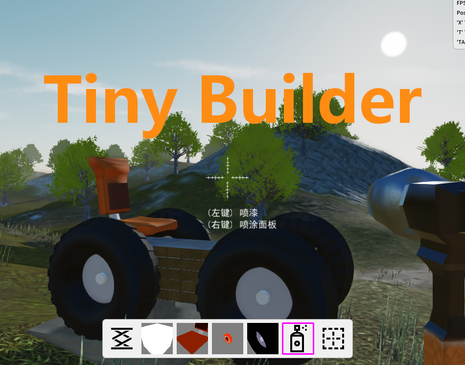

===================
### What's This?

<b>Cube Engine</b> is my own hobby project, It's a small Graphic Engine written in c++ and powered by OpenGL and Vulkan, I develop it so that I can improve my knowledges of CG and common programming Skills(generic algorithm, code style, design patterns).

### Some tools

<b>CubeModelConvertor</b>: CubeEngine's model convertor. https://github.com/tangziwen/CubeModelConvertor  
<b>CubeTracer</b>: a simple path-tracer. https://github.com/tangziwen/cubeTracer  
